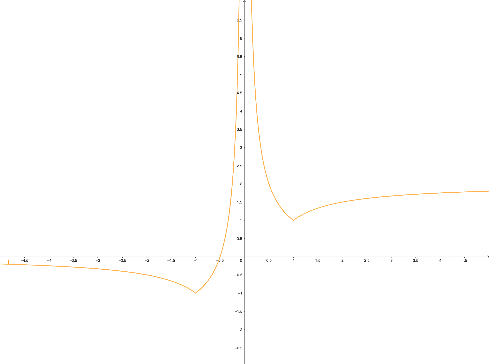



## Early years

### Circular arguments & hubris
Although my father has recounted stories from as far back as when I started developing the ability to speak, my first
concious recollection of when my passion for math started was around 10. I think I had been frustrated with the
"inexactness" of \\(\pi\\), and was convinced I could do better. After playing around, I discovered a new, "exact"
constant---\\(\small 0.636942675\\)---which I can still recite from memory. I was wrong—I got that constant by various
calculations based on the diameter of a circle and its circumference, which I had calculated from \\(\pi\\). Indeed,
\\(\small 0.636942675 = \frac{2}{3.14}\\).

This is how I learned about  and started learning about
 (I would not finish learning that lesson until 17 years later).

### Never stop digging

As a kid, I was fascinated by prime numbers, and was convinced there was a pattern to be found. The number of hours I
spent just playing around with them is incalculable - everything from excel sheets, to plots, to [badgering strangers on
the internet](https://www.scienceforums.net/search/?&q=prime&author=Shadow&search_and_or=or) with my newest idea on how
it could be done.

One of my experiments seemed to show something very special was going on with the number \\(\small 71\\), and I got very
excited.

<iframe width='100%' height = '500' src='https://www.wolframcloud.com/obj/gabrielshanahan/Published/Prime spiral' frameborder='0'></iframe>

This lead me down a rabbit hole which traversed various corners of the internet, involved a consultation with the
[former president's brother](https://en.wikipedia.org/wiki/Ivan_M._Havel), and ended with an e-mail exchange with [Eric
Wong](http://www.primenumbers.net/Renaud/eng/PSpiral.html), just a month before his e-mail account expired.

The fundamental reason this is happening turns out to be related to the fact that \\(\small 710 \approx 0 \pmod{\pi}\\).

This how I learned to  when I don't understand something, and to


### Perseverence

I had been interested in programming for some time, and first gave it a shot when I was probably around 14 or 15. My
first introduction was via. [howstuffworks.com](https://www.howstuffworks.com/), specifically their article on the [C
programming language](https://computer.howstuffworks.com/c.htm). My first exposure to the concept of looping was
[here](https://computer.howstuffworks.com/c10.htm).

Today, I can recognize that last example as a bubble sort, but back then, I had no idea about anything. I had to write
out each iteration by hand, and while I could see that it really did sort the numbers, I had absolutely no clue why. Due
to way it was presented---without any explanation whatsoever about the mechanics of *how* it was that this strange thing
ended up sorting numbers in a list---I was under the impressions that it was supposed to be obvious, and came away
convinced that I would never be smart enough to be a programmer. Today, I understand that almost nobody would've been
able to figure that out given the information I had available, and I'm frankly still amazed that I managed to
(eventually) wrap my head around it, and most importantly that it didn't deter me.

This is how I started to learn 

### Reasoning from first principles

One of the first things I wrote, for reasons I can't remember, was a simple program that converted Celsius to Fahrenheit
and back. It felt incredible to be able to do something like that, and I (naively) decided to expand it to cover
conversions between all units possible. Up to that point, all my variable names had been single letters like `x` or `y`,
perhaps with a number appended, because the only code I had ever seen were short examples demonstrating a language
feature, and I had no other reference. When I started expanding my program to more units, things quickly got messy.

It suddenly dawned on my that if a variable could be named with two characters, such as `x4`, then it should be able to
handle any number of characters - therefore, I could name them based on what they *contained*. I tried it, and sure
enought, it worked. This was an earth-shattering moment for me, for reasons I couldn't really explain until much later.
Today I understand that I was experiencing severe cognitive dissonance---naming variables after what they contained
seemed like a complete no-brainer in retrospect, so why didn't I do it straight away? Why hadn't I, even for a second,
thought to do something so simple and obvious?

The reason I didn't was because I was operating by analogy, imitating things I had seen, instead of from first
principles, where I would pause, think critically about each thing I was doing, question if it made sense, if I could
explain *why* I was doing it, and *why it made more sense* than a different approach. If there is a single thing I can
point to that sets me appart from most colleagues I've worked with, it's my automatic tendency to do this. None of what
I'm describing was conciously understood or verbalized for at least another 15 years, but in retrospect, I can point to
this as the moment where this tendency materialized.

This is how I learned to 

### Building & losing something beautiful

A while later, I finally discovered the amazing [Learn C++](https://www.learncpp.com/), binge-read it over a weekend,
and learned C++. I'm still mildly impressed that I was able to grasp the concepts of virtual functions and templates
without any difficulty whatsoever - we still had dial-up internet back then, so I didn't know it was supposed to be
difficult. Not long after, I wrote my first real app - a simulation of newtownian gravity, rendered with
[Allegro](https://liballeg.org/). I created multiple iterations of the app, progressively making the code more
organized, polishing the way the rendered stars looked, etc.

I finished the final version while on a family vacation in Croatia, and it was perfect. However, about three days later,
I (deliberatelly) wiped my hard drive, not realising I hadn't backed up my code. When I realized what I had done, it
broke my heart. I created two or three new versions, trying to get the one I had manage to build, but I never did. I
still feel sad.

The emotional scarring from this experience was such that I became paranoid about losing work and became religiously
careful not to repeat that mistake. Since that time, it's only ever happened once, which was perhaps even more brutal,
because it was at the end of an all-nighter, and I lost everything I had built during the night.

This is how I learned what it felt like to  and how to subsequently
lose it.

### Abstract things are tools

I experimented with drugs quite a bit during high school. On one Sunday afternoon, I got high, and (as one does) set out
to write down an equation for a plot which would look like \\(\small \frac{1}{x}\\), but reflected verticaly at the
points \\(\small x = \pm 1\\). After a few hours in a trance which I do not remember, I sat in front of the following,
scribbled on a piece of paper:

$$
\small
\begin{split}
f(x) &= \frac{\operatorname{sign}(-x - 1) + 1}{2} \cdot \frac{1}{x} 
\\\\     &+ \left(\frac{\operatorname{sign}(x + 1) + 1}{2} - \frac{\operatorname{sign}(x) + 1}{2}\right) \cdot \left(-\frac{1}{x} - 2\right) 
\\\\     &+ \left(\frac{\operatorname{sign}(x) + 1}{2} - \frac{\operatorname{sign}(x - 1) + 1}{2}\right) \cdot \frac{1}{x} 
\\\\     &+ \frac{\operatorname{sign}(x - 1) + 1}{2} \cdot \left(-\frac{1}{x} + 2\right)
\end{split}
$$

I don't remember this by heart---I just derived it again in about 5 minutes. The trick is to tweak the \\(\small
\operatorname{sign}(x)\\) function to be \\(\small +1\\) only on a given interval, and \\(\small 0\\) everywhere else.
Then, just multiply by what you want the plot to be on that interval.

This is how I learned to 

### Appreciation is limited by comprehension

Some time after, during our (completely rudimentary) IT class, we were tasked with writting a program in JavaScript
that, given 4 numbers denoting two intervals, where one is contained in the other, and an input number, we should
determine if the number lies either a) within the inner interval, b) within the outer but outside the inner, c) outside
of the outer, or d) if it was one of the boundary points of the intervals. An additional challenge was posed to write
this with the smallest possible number of conditionals possible. Naturally, there is some minimal amount (probably 3-4)
that you just couldn't go beneath.

Using the \\(\small \operatorname{sign}(x)\\) hack from above and taking advantage of the way JavaScript handles `NaN`
(I had defined \\(\small \operatorname{sign}(x)\\) as \\(\frac{|x|}{x}\\)), I was able to write a version that used no
conditionals at all. I was ecstatic, and couldn't wait for the next lesson, when I would be able to publicly bask in the
glory of being smart. The teacher, a recovering alcoholic who was known for dating students, went through the
assignments one by one in front of the entire class, shaming most, praising few. When my moment finally came, he opened
up my code, stared at it for 5 seconds, said "this is different", closed it, and moved on.

It's been nearly two decades, and I'm still pissed.

This is how I discovered that
. I'm
still learning that lesson. There's also a hubris lesson in there, but I'll forever be too outraged at the injustice to
accept it.

### Teaching

About midway through my high school years, I started tutoring math, which I would continue to do until the end of my
university years. I loved it, I was good at it, and within a year, I was being approached left and right. I soon started
charging money for my lessons, which was the first real income I ever made--considering my age, it was actually very
decent. Naturally, I spent it all on drugs.

I learned a great many things:

*  anything, to anyone. There is very little in this world that makes me happier.
*  People have much, much more
  intellectual capacity than they think they do.
  * I would regularily involve "clueless" friends in discussions (well, mostly monologues) about university level math,
    and while they probably weren't particularily enjoying themselves, they understood just fine.
  * I can recall only three people in my entire life that were beyond my ability to reach---all of them had palpable
    mental disorders.
*  (i.e. that people are
  stupid, and nothing can be done about it), both when it concerns them and when it concerns others. They are
  wrong---the former is a lack of effort, the latter a lack of faith, and both are a lack of patience. After teaching
  things to people in some form or another for nearly two decades, I can state that conclusivelly.
  * Even worse, people tend to view this as predetermined - people think you're either born smart or born stupid.
  * A consequence of both the preceeding points is that people do not invest time and effort, feeling it's pointless.
    This completes the circle, and makes it into self-fulfilling prophecy.
  * None of this is specific to math. I've had this argument with friends, family and coworkers, over and over
    throughout the course of my entire life.
* People don't understand that much of what is percieved as superior intelect is just 
* The level of complexity at which innate intelectual ability starts to become a key factor is far beyond what most
  people encounter during the course of their lives. In other words,
  
  
  
  ## University years
  
  I was looking forward to university, but then I found out that they (classmates and proffesors) didn't know anything
  either - prvni matalyza, dukaz iracionality odmocniny ze dvou.
  
  A year late, I resigned to the fact that I would never have anyone to talk to, and stopped talking about the things I
  like. I no longer have the capacity to discuss these things over e.g. beer.
  
  Couldn't say "I don't know" -> ego
