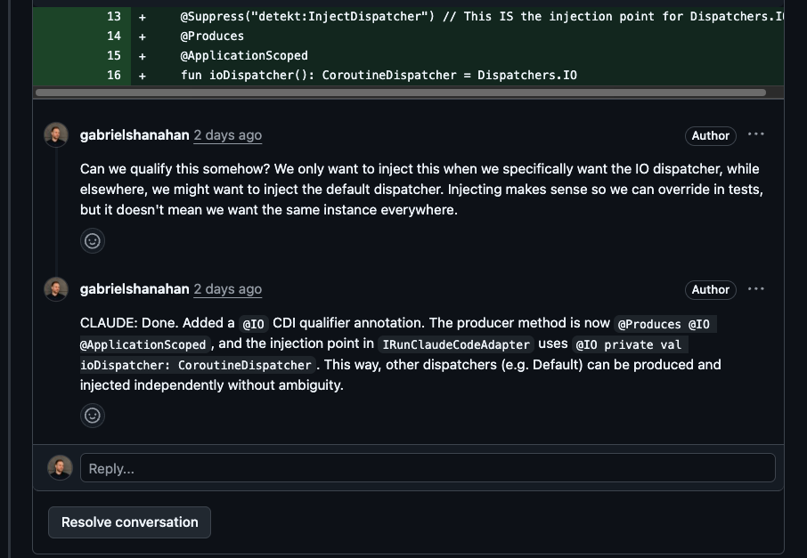

The way we interact with AI is surprisingly primitive. You have a chat window. You type a message. The AI responds. You
type another message. It's linear, sequential, one-thread-at-a-time---the same interaction model as a 1990s IRC channel.

But the things we build with AI are not linear. They're documents with sections, codebases with files, images with
regions. When you're working on a structured artifact with an AI, you're not having *one* conversation---you're having
*many*, about many different parts of the thing, all at once. The chat window forces you to serialize all of that into a
single stream. You end up splicing multiple topics into one thread, accumulating TODO lists, mentally tracking what was
addressed and what wasn't, scrolling back and forth to maintain context. Things get lost. Things get tangled.

What you actually want is to point at a specific part of the artifact and start a conversation *right there*---and have
that conversation exist independently from all the others. You want to be able to jump between topics without losing
context, revisit earlier discussions without scrolling, and work on multiple things in parallel without waiting for the
AI to finish one before starting another.

In other words, you want **threaded, anchored conversations**---many parallel interactions, each tied to a specific piece
of the artifact you're working on.

Here's the thing---**nothing about my solution is particularly ground-breaking.** I'm almost embarrassed to publish this as if
it were some kind of revolutionary idea, almost as much as I'm embarrassed by the fact that it's taken me this long to have
it in the first place. Honestly, I wouldn't be surprised if I found out most of the world was already doing this, and I'm the
last one to the party. It's so stupid.

Yet I can't help but be amazed at the impact it had on my everyday work, and now I'm pissed everytime I find myself in
a situation where I can't use it.

## Developers already have this

If you write code, you already use this interaction model every day. It's called a **pull request**. A PR gives you threaded
discussions anchored to specific lines. You can jump between files, start conversations wherever you want, revisit
earlier threads, resolve them when they're done, and see the full context of each discussion. Nothing gets lost, nothing
gets tangled. Each thread is its own mini-conversation.

The principle generalizes beyond code. Any artifact with addressable parts---paragraphs in a document, regions in an
image, timestamps in a video---could support this kind of interaction. It just so happens that for code, the tooling
already exists and works well.

## Making Claude participate

The missing piece was getting Claude to actually *live* in this interface---not as a one-shot tool, but as an active
participant that responds to conversations in-place. Claude Code's recent addition of
[scheduled tasks](https://code.claude.com/docs/en/scheduled-tasks) made this particularly easy to set up.

The setup is simple. I tell Claude Code to:

1. **Create a PR** with the generated code
2. **Start a background cron** that periodically checks the PR for new comments
3. **For each new comment**: read the context, make the fix, reply to the thread, and push

Then I leave the chat and **live entirely in the PR**. I start conversations on specific lines, ask questions, request
changes. Claude picks up each thread on the next poll cycle, responds, and pushes. What's key is that I don't wait for
that to happen---I just continue reading and firing off comments. At some point, I go back, check the results, continue
the conversation in each thread if needed, or resolve and move on.

The difference is night and day. Instead of a single serial conversation where I have to queue up all my thoughts and
track their resolution, I have a dozen parallel ones, each with its own context, each progressing independently. I can
leave six comments across three files, go do something else, and come back to find all of them addressed. I don't have
to babysit the chat.

## Try it

I've published the [Claude Code skill and supporting scripts as a Gist](https://gist.github.com/gabrielshanahan/6c2f1a5e40e33040b306b375b42ffc5e), or you can just ask Claude to build it for
you from scratch.


**One detail worth mentioning**: fixes are amended into the original commits, not added as separate "address review"
commits. The history stays clean, as if the fix was always there.


To set it up:

1. Copy `skill.md` into `.claude/skills/babysit-pr/` in your project
2. Put the three shell scripts somewhere on your `PATH` (or adjust the paths in the skill file)
3. You'll need `gh` (GitHub CLI) and `jq`
4. Run `/babysit-pr https://github.com/you/repo/pull/42`, or just tell Claude to babysit a PR

Stop it anytime by closing the Claude session, or asking it to stop babysitting the PR.

## The bigger picture

It's worth stepping back and noticing what I actually did here: I routed my AI interactions through *GitHub pull
requests*. That's not a natural (or particularly secure) home for this---it's a workaround. A pretty good one,
but still---I'm piggybacking on code review infrastructure because it happens to have the threading model I want.

So, why *doesn't* this exist natively? Chat became the default AI interaction model, I think, mostly
because LLMs arrived as chatbots. That made sense at first. But somewhere along the way, AI went from "thing I ask
questions" to "thing I build stuff with," and the interface didn't really keep up. **When you're collaborating on an
artifact, the artifact is the main thing.** The conversation is secondary---it's how you shape the artifact, not the
point of the interaction.

At the same time, it should be said that threaded conversations on artifacts aren't a new idea at all. Google Docs has had comment
threads on paragraphs for years. Figma lets you pin discussions to specific points on a design. PRs anchor threads to
lines of code. The pattern is well-established. It's just that when AI got added to these kinds of workflows, it mostly
showed up as a sidebar chat rather than plugging into the threading that was already there. I'm sure
there are tools that do this right, but most of the time the interaction model for AI, especially on the web and in agents,
is still a chat window.

I think there's something to the idea of AI agents, and AI web interfaces, supporting this natively---not "here's a chat window, and also here's
your document," but "here's your document, and you can talk to the AI about any part of it, right there." Each thread
as its own conversation with its own context. Six discussions going at once on six different parts of the thing, none of
them stepping on each other. Claude Code sorta-kinda took a step in this direction with its recent addition of `/btw`,
but that's still a long way from what I'm talking about here.

And it doesn't have to be code. Any artifact with addressable parts could work this way---a contract where you're
discussing clause 4.2 in one thread and the indemnification section in another, a data pipeline config where you're
asking about the transform step separately from the source connector, a design mockup with one conversation about the
navigation and another about the color palette. Even an image region, or a section of an audio file.

For now, I've got a polling loop built on `gh` and `jq`, and honestly, it works better than I expected. But I'd love to
not have to need it.
