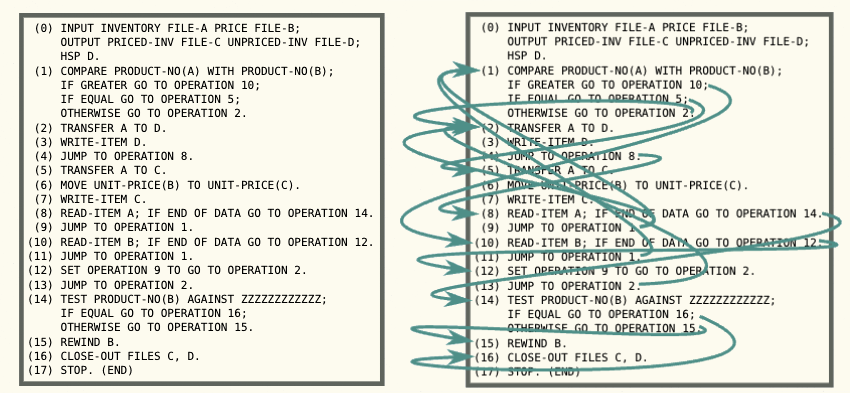
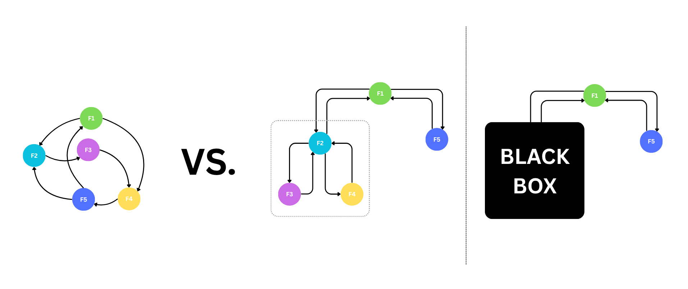
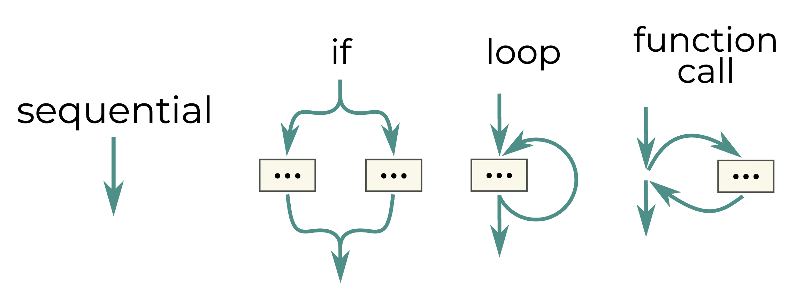
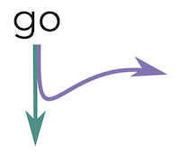
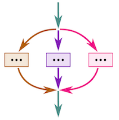
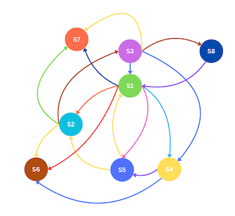

Now that we've talked at length about *what* you get when you apply the rule of structured cooperation---and I hope I've
convinced you that it's quite a bit---I want to finally talk about *why*. What makes that rule so special, and why is it
so unreasonably effective?

As it turns out, these questions actually have an answer, and structured cooperation didn't just fall out of the sky. In
fact, as we explore the answers and take a journey through some of the most fascinating parts of programming language
history, you will find that it is actually just the newest incarnation of a principle, an *idea*, we've been applying
for over half a century, and that has fundamentally affected each and every piece of code written during that time.

## Standing on the shoulders of giants

I have to confess that I'm actually a little embarrassed to put structured cooperation and Scoop out with my name next
to it, because essentially all I've done is plagiarize the work of two giants---[Nathaniel J.
Smith](https://vorpus.org/) and [Roman Elizarov](https://x.com/relizarov), along with the rest of the Kotlin team.

While Nathan
[emphasizes](https://vorpus.org/blog/notes-on-structured-concurrency-or-go-statement-considered-harmful/#nurseries-a-structured-replacement-for-go-statements)
he's not the author of structured concurrency, his phenomenal article, [Notes on structured concurrency, or: Go
statement considered
harmful](https://vorpus.org/blog/notes-on-structured-concurrency-or-go-statement-considered-harmful), introduced me to
the idea, and his explanation is what allowed me to recognize that the way we currently design distributed systems
suffers from fundamentally the same type of problem that structured concurrency was invented to solve. I really can't
oversell his article---it's been years since I first read it, I've read it many times since, and I will never shut up
about it. I've mentioned it [in my talks](https://youtu.be/7NQC4WBKfQk?t=2772), as did Roman Elizarov [in
his](https://youtu.be/Mj5P47F6nJg?t=2679), and I think it should be considered required reading for every single
developer. I think it's to be one of the best programming articles out there, period, because apart from doing an
incredible job of explaining a non-trivial subject, between the lines, it reveals something very fundamental about the
essence of programming. If you haven't read it yet, I thoroughly recommend you do so, along with his article on
[timeouts and cancellations](https://vorpus.org/blog/timeouts-and-cancellation-for-humans/), which I copied pretty much
verbatim in Scoop.

Roman needs no introduction to anyone even vaguely aware of [Kotlin](https://kotlinlang.org/), of which he was the lead
designer for years, [publishing many insightful articles](https://elizarov.medium.com/) along the way. When you start
learning about how Scoop is implemented, you'll discover that it is little more than a crude implementation of
distributed coroutines on top of Postgres. I wouldn't have recognized that *that* was the proper way to what model I was
trying to achieve if I hadn't previously interacted with Kotlin's coroutine implementation. I can say unequivocally that
Scoop would not exist in its current form were it not for the work of Roman and his team---not merely because I had an
existing implementation that I could reference when I needed to, but most importantly because interacting with
coroutines in Kotlin, along with their ecosystem, gave me *perspective*, and framing Scoop in that way allowed me to
anticipate features and capabilities I should be implementing. Scoop is much more cohesive as a consequence.

There has never been a more fitting time to say: *If I have seen further, it is by standing on the shoulders of Giants.*

## GOTO statement considered harmful
Ask any programmer what they think of `GOTO`, and I'm willing to bet that the overwhelming majority answer with *"`GOTO`
is bad and should not be used"*. Now ask them why, and I'm willing to bet that an overwhelming majority can't really
give a satisfactory answer. The term *'spaghetti code'* will probably be uttered in a Pavlovian reflex we've all been
conditioned to have, but even asking about *that* will probably quickly lead to an argumentum ad populum – it's true
because that's what everyone says.

Here's the thing, though---you don't actually need `GOTO` in your language to be able to write spaghetti code. For
example, Nathan gives the following [spectacular
example](https://vorpus.org/blog/notes-on-structured-concurrency-or-go-statement-considered-harmful/#what-is-a-goto-statement-anyway)
of some incantations written in [FLOW-MATIC](https://en.wikipedia.org/wiki/FLOW-MATIC), a language that has `GOTO`:



Here's essentially the same code, jumping around in exactly the same way, rewritten in JavaScript (or so
[Claude](https://www.claude.ai/) assures me), a language that has no `GOTO`:


```javascript
function flomaticProcessor() {
    let operation = 0;
    while (true) {
        switch (operation) {
            case 0: 
                if (inventoryIndex < inventoryFile.length) currentInventoryItem = inventoryFile[inventoryIndex]; 
                if (priceIndex < priceFile.length) currentPriceItem = priceFile[priceIndex];
            case 1: 
                if (!currentInventoryItem) { operation = 14; break; }
                if (!currentPriceItem) { operation = 12; break; }
                if (currentInventoryItem.productNo > currentPriceItem.productNo) operation = 10;
                else if (currentInventoryItem.productNo === currentPriceItem.productNo) operation = 5;
                else operation = 2; 
                break;
            case 2: unpricedInvFile.push({ ...currentInventoryItem }); operation = 8; break;
            case 5: pricedInvFile.push({ ...currentInventoryItem, unitPrice: currentPriceItem.unitPrice });
            case 8: 
                inventoryIndex++; 
                if (inventoryIndex >= inventoryFile.length) { 
                    currentInventoryItem = null; 
                    operation = 14; 
                    break; 
                } 
                currentInventoryItem = inventoryFile[inventoryIndex]; 
                operation = operation9Target; 
                break;
            case 10: 
                priceIndex++; 
                if (priceIndex >= priceFile.length) { 
                    currentPriceItem = null; 
                    operation = 12; 
                    break; 
                } 
                currentPriceItem = priceFile[priceIndex]; 
                operation = 1; 
                break;
            case 12: operation9Target = 2; operation = 2; break;
            case 14: 
                if (!currentPriceItem) { operation = 16; break; }
                if (currentPriceItem.productNo === "ZZZZZZZZZZZZ") operation = 16;
                else operation = 15; 
                break;
            case 15: priceIndex = 0; currentPriceItem = priceFile[priceIndex];
            case 16: return "PROGRAM_END";
            default: return "ERROR";
        }
    }
}

flomaticProcessor();

```

It's clear that the [WTF's/min](https://commadot.com/wtf-per-minute/) for this function have no upper bound, but
nobody's in any hurry to ban switch statements and while loops---it's clear that spaghettification susceptibility isn't
in itself a sufficient reason to remove a language feature. So why did we ban `GOTO`, and why do we all think delicious
pasta is the reason?

### In what manner doth the Spaghetti Monster squiggle?
We all intuitively understand that the code above is abysmal, but it might not be immediately clear how to formulate
what is wrong with it. The code is clearly very difficult to make sense of, but why?



Fundamentally, it's because we can't organize the path of execution into a hierarchy---the path the code takes forms a
*graph*, not a *tree*. Without this property, in order to determine what path a program will take, we need to be aware
of the contents of each "node" (intuitively representing a function call, but in general can be any "block of
statements") in the diagram above. Any one of them could at any point send the execution flow someplace else, and the
only way to find out is to open *each and every one* and see what it does. As a consequence, we’re deprived of one of
the key faculties needed to grasp complex code---the ability to think in terms of black boxes.

If you spend some time thinking about it, you will realize that in order to be able to form this kind of execution flow
hierarchy, the code must be structured in such a way so that it follows what Nathan [calls the "black box
rule"](https://vorpus.org/blog/notes-on-structured-concurrency-or-go-statement-considered-harmful/#goto-the-destroyer-of-abstraction):
whenever the flow of execution goes *into* something, it must be guaranteed to always, at some point, *come back out*.
That "something" could be anything representing a group of statements---a function, an if statement, a for loop,
whatever you like.

Here's the key thing: even though the JavaScript example above breaks that rule, it only breaks it *locally*. By that, I
mean I can take that whole mess, throw it in a function, close my eyes and forget what I just saw, and that function
will behave just like any other function would---execution flow will go in, it'll do its thing, and then it'll come out.
There is no way for the function (or almost any other modern construct for that matter[^exceptions]) to wrestle control
away from the caller and not give it back. Whatever mess the block of code decides to inflict on itself, it must always
eventually yield control back to its caller.

[^exceptions]: <small>One notable exception to this is, well, exceptions, which is fundamentally why it's so easy to
screw up a codebase by not using them diligently. This was the subject of [one of my
talks](https://www.youtube.com/watch?v=7NQC4WBKfQk).</small>

But the old-school `GOTO`, in its full, unfettered glory, allows any piece of code to jump to any other piece of code
anywhere in the program. By doing that, it allows anyone to take over the execution flow and not give it back, and
there's fundamentally no way to control or restrict that power. The only way to guarantee it is not (mis-)used is by
reading every single instruction that comprises the entire execution path, and verifying that either `GOTO` isn't used,
or it's used in a way that doesn't break the black box rule. Having to open, parse, and understand each and every
function that is called, and the functions they call, the functions *they* call, and so on, is fundamentally what breaks
our ability to compartmentalize, which, in turn, breaks our ability to reason about code of any real complexity. If
messy execution flow was cancer (which it is), `GOTO` is what allows it to metastasize.

So spaghettification is not, in fact, the reason why `GOTO` was banned, but rather its ability to potentially make the
spaghetti strand squiggle across the entire codebase. Even with `GOTO` gone, you can still make spaghetti, but each
strand can only squiggle within the confines of some delimited code block (typically a function), and must eventually
always come out again.

This fundamental problem with `GOTO` was described by none other than E. W. Dijkstra (pronounced Dyke-strah---now you
finally know), when, in 1968, he published [Go To Statement Considered
Harmful](https://homepages.cwi.nl/~storm/teaching/reader/Dijkstra68.pdf). It's only a page and a half; I suggest you
read it. There, he argues that `GOTO` *"should be abolished from all 'higher-level' programming languages"*, triggering
an industry-wide tantrum. As Nathan writes:

> From here in 2018, this seems obvious enough. But have you seen how programmers react when you try to take away their
> toys because they're not smart enough to use them safely? Yeah, some things never change. In 1969, this proposal was
> incredibly controversial. [Donald Knuth defended
> goto](https://scholar.google.com/scholar?cluster=17147143327681396418&hl=en&as_sdt=0,5). People who had become experts
> on writing code with goto quite reasonably resented having to basically learn how to program again in order to express
> their ideas using the newer, more constraining constructs. And of course it required building a whole new set of
> languages.

But, as we now know, cooler heads prevailed, and history reduced `GOTO` to the [butt of jokes](https://xkcd.com/292/).

### One door closes, many others open
Enforcing a hierarchy on execution flow by removing `GOTO`, and requiring that all constructs obey the black box rule,
bore fruit beyond "just" the fact that it made code much easier to reason about. It also allowed us to make the position
in this hierarchy explicit, which is pretty much what we know today as a [call
stack](https://en.wikipedia.org/wiki/Call_stack). That, in turn, allowed us to build exceptions, complete with stack
unwinding and stack traces. Can you even imagine maintaining a codebase without having a stack trace at your disposal
when something breaks? If not, try writing some reactive code, see how long it takes for you to cry[^cry]. And
crucially, this would have been very difficult, if at all possible, to do if `GOTO` were still around.

[^cry]: <small>I was stupid enough to start with the reactive version when prototyping Scoop. I cried a lot.</small>

Another feature enabled by killing off `GOTO` are the various flavors of resource handling constructs, e.g.
[`try-with-resources`](https://docs.oracle.com/javase/tutorial/essential/exceptions/tryResourceClose.html). How would
that even work if you could just jump into the middle of a `try` block from wherever?[^continuation] What about garbage
collection? Various compiler optimizations? None of those would be possible in the way we're used to if we kept `GOTO`
alive. Removing `GOTO` led directly to the advent of many of the features we now take for granted, features that
wouldn't be possible otherwise.

[^continuation]: <small>This is one reason why [it's difficult to build a practical language with full-blown
continuations](https://okmij.org/ftp/continuations/against-callcc.html#dynamic_wind). If you don't understand what any
of that means, don't worry about it.</small>

This should come as no surprise---*restricting* the set of permissible programs allows you to *rely* on patterns that
become *enforced* by those restrictions, and you can take advantage of those patterns to build new features. That's also
fundamentally why the capabilities of IDE's for statically typed languages are (and always will be) better and more
reliable than those for dynamic ones.

In programming, as in other things, less is often more.

### Visualizing control flow

Nathan introduces an excellent visual notation that I will be switching to for the remainder of this post, and one that
clearly shows how and why `GOTO` is different from other language constructs. The notation represents the "shape" of
execution flow, but frankly it's so intuitive that using words to describe it only makes it less so.

Here are the depictions of the constructs we're familiar with:



Here's `GOTO`:


As Nathan writes:

>For everything except goto, flow control comes in the top → [stuff happens] → flow control comes out the bottom. We
>might call this the "black box rule": if a control structure has this shape, then in contexts where you don't care about
>the details of what happens internally, you can ignore the [stuff happens] part, and treat the whole thing as regular
>sequential flow. And even better, this is also true of any code that's composed out of those pieces. When I look at this
>code:
>```
>print("Hello world!")
>```
>I don't have to go read the definition of `print` and all its transitive dependencies just to figure
>out how the control flow works. Maybe inside `print` there's a loop, and inside the loop there's an if/else, and inside
>the if/else there's another function call... or maybe it's something else. It doesn't really matter: I know control will
>flow into `print`, the function will do its thing, and then eventually control will come back to the code I'm reading.

## Structured concurrency---GO statement considered harmful

Fast forward about half a century---the year is now 2016, `GOTO` is dead and buried, and concurrent programming is all
the rage. Every major language has introduced some sort of primitive that represents "spawn a separate branch of
execution, and execute both branches concurrently---the eponymous `go` of Go, `new Thread(...).start()` in Java, and so
on.

Some suspiciously familiar problems were arising in that area. Concurrent programs were notoriously difficult to reason
about, error handling was error-prone (the industry default for handling errors in something spawned from the main
thread was---and still is---often just "drop the error and hope for the
best"<sup><small>[[1]](https://www.oreilly.com/library/view/c-cookbook/0596003390/ch15s03.html),
[[2]](https://stackoverflow.com/questions/6546193/how-to-catch-an-exception-from-a-thread),
[[3]](https://docs.python.org/3/library/threading.html#threading.excepthook),
[[4]](https://doc.rust-lang.org/std/thread/)</small></sup>), and when something did inevitably break, debugging was a
nightmare. Stack-traces only showed information about the stack of the thread that failed, but it was impossible to
determine where it was spawned from or under what conditions, unless you somehow kept track of that yourself.

But there were also new problems. Race conditions and synchronization became a thing you needed to deal with, and a slew
of APIs were built to address this issue, including [synchronized
methods](https://docs.oracle.com/javase/tutorial/essential/concurrency/syncmeth.html), various flavors of
[mutexes](https://en.wikipedia.org/wiki/Lock_(computer_science)),
[semaphores](https://en.wikipedia.org/wiki/Semaphore_(programming)), and other things. You needed to figure out how,
when, and when *not* to share data between different branches of execution, leading to things like [atomic
variables](https://en.wikipedia.org/wiki/Atomic_semantics),
[ThreadLocal](https://docs.oracle.com/javase/8/docs/api/java/lang/ThreadLocal.html), and an entirely separate set of
[concurrency-safe collections](https://docs.oracle.com/javase/tutorial/essential/concurrency/collections.html). If you
screwed up, you would at best get an exception, at worst a
[deadlock](https://en.wikipedia.org/wiki/Deadlock_(computer_science)) or silent bug, and it would only happen sometimes.
God forbid you needed to deal with something non-trivial, like timeouts, interruptions, or cancellations (think
`Ctrl-C`).

Needless to say, all of this is really difficult, and all of these difficulties compound. Concurrent programming is a
*pain*. And as it so happens, this is the control flow diagram for all of the primitives that were mentioned above
(Nathan labels them all as `go`):



[Coincidence? I think not!](https://www.youtube.com/watch?v=MDpuTqBI0RM)

I'll defer to [Nathan's
article](https://vorpus.org/blog/notes-on-structured-concurrency-or-go-statement-considered-harmful/#id15) for the
blow-by-blow, but suffice to say that, yes, the similarity of the diagrams is no coincidence---thread spawning mechanism
are guilty of the same type of sin as `GOTO`, and consequently cause the same type of problems. They don't do this by
snatching control away from the caller, but rather splitting the execution into separate strands, and only "returning"
one to the caller. In that sense, you could argue that this is an even more precarious state of affairs than with
`GOTO`, because instead of a single spaghetti strand, you can now have 2 or more strands squiggling through the
codebase.

I should note that when I say "thread", I mean it in the general sense of "branch/path of execution"---it could be an OS
thread, a green thread (e.g., a [goroutine](https://go.dev/tour/concurrency/1) or [virtual
thread](https://rockthejvm.com/articles/the-ultimate-guide-to-java-virtual-threads)), a
[coroutine](https://kotlinlang.org/docs/coroutines-overview.html), a
[promise](https://developer.mozilla.org/en-US/docs/Web/JavaScript/Reference/Global_Objects/Promise) chain, or something
else.

The solution? Structured concurrency. I recommend you read up on the concept if you're not familiar with it, since I
won't be going into sufficient detail for my explanation to qualify as an introduction (Nathan's article is an excellent
place to start). However, I do want to walk through the essentials, because you'll immediately recognize their
counterparts in structured cooperation.

In a nutshell, the basic idea is to mandate that separate threads of execution can only be launched from within a
special code block---in Kotlin, it's the lambda parameter passed to the
[`coroutineScope`](https://kotlinlang.org/api/kotlinx.coroutines/kotlinx-coroutines-core/kotlinx.coroutines/coroutine-scope.html)
function; in Nathan's Trio, it's [inside the `with`
block](https://trio.readthedocs.io/en/stable/tutorial.html#okay-let-s-see-something-cool-already) that delimits the
lifetime of the Nursery object; in Java (still in preview at the time of writing), it's [inside the `try-with-resources`
block](https://docs.oracle.com/en/java/javase/21/core/structured-concurrency.html) that delimits the lifetime of the
`StructuredTaskScope` object; in Swift, it's inside the lambda parameter passed to the
[`withTaskGroup`](https://developer.apple.com/documentation/swift/withtaskgroup(of:returning:isolation:body:)) function,
and so on.

Crucially, **that code block does not exit until everything it spawned has finished running. If the execution of the
spawning thread gets to the end of the block before all the threads it spawned have finished, it stays there and
waits.** This is the fundamental rule that structured concurrency is built around.

Here's a simple example in Kotlin that drives this home:

```kotlin
print("1")
coroutineScope {
    print("2")
    launch {
        delay(1000L)
        print("4")
    }
    print("3")
}
print("5")

// prints 12345, with a ~1s delay between printing 3 and 4
```

In most implementations, the code block is typically associated with an object whose lifetime is tied to it, i.e., it is
created just before the code block is entered, and ceases to exist right after the code block is exited. In Kotlin, this
object is the
[`CoroutineScope`](https://kotlinlang.org/api/kotlinx.coroutines/kotlinx-coroutines-core/kotlinx.coroutines/-coroutine-scope/),
in Trio, it's the [`Nursery`](https://trio.readthedocs.io/en/stable/reference-core.html#trio.Nursery) , in Java, it's
the
[`StructuredTaskScope`](https://download.java.net/java/early_access/loom/docs/api/java.base/java/util/concurrent/StructuredTaskScope.html),
in Swift, it's the [`TaskGroup`](https://developer.apple.com/documentation/swift/taskgroup). This object conceptually or
literally represents a sort of "container" into which any spawned execution threads are placed, along with any child
containers, and you can pass it around and spawn tasks "into" it from (lexically) outside the code block it represents
(as long as the block hasn't finished in the meantime). Any such tasks are treated as if they were spawned from within
the code block.

If this is the first time you're encountering structured concurrency, it might not be immediately obvious that this is
an improvement over doing it any other way, but as anyone that has actually used it for any amount of time knows, and as
the adoption across a wide range of languages and libraries backs up, this approach makes concurrent programming much,
*much* easier to deal with. It by no means solves all the problems inherent to concurrent programming---concurrent
programming is still hard, still full of unique challenges, and it's still easy to shoot yourself in the foot.


By imposing a hierarchy on the threads of execution and mandating that each parent needs to wait for its children, it
cuts away an whole host of significant problems, as you'll see in the next section.

Why?

Well, this is the control flow diagram of blocks that obey the rule of structured concurrency:



And as you can see, it obeys the black box rule---a single thread of execution goes in, and a single thread of execution
comes out.

Coincidence? I think not.

### One door closes, many others open

#### Reasoning

By *restricting* what programmers could do, we *recovered* many features that were lost when concurrent programming
first took off. Chief among those, as you can probably guess, is the ability to think in black boxes. Previously, any
function anywhere, at any depth, could just decide to spawn a thread, and the only way to know for sure is to open up
every function recursively and check. 

In practice, that's actually not that much of a problem---spawning a separate thread of execution is usually (though not
always) a pretty expensive operation, so people don't tend to spawn them willy-nilly just for the fun of it (and if they
do, their code is unlikely to proliferate much). But there is another, more realistic concern: for functions that
legitimately do spawn threads, even when they openly advertise it, you still have no guarantees about what happens to
those threads when the function exists. Do they keep living in the background? Are they finished, and did the function
clean them up? Will that always happen, even when exceptions get thrown? Do I need to kill them or manage them
somehow? Is there any situation where they become my responsibility? Is there some orchestrator somewhere else who also
interacts with them? And in order to answer those questions, you have no choice but to concern yourself with what that
function does and how it's implemented. You can no longer treat it as a black box.

With structured concurrency, you don't need to worry about that, ever. If a function returns (either normally or by
throwing an exception), everything it spawned has either finished and been cleaned up or was placed into some sort of
"scope" (the container objects mentioned above) that needs to be passed in. If that's the case, you can clearly see that
the object is part of the function's signature, and that the threads are therefore someone else's problem (specifically,
whoever provided the scope object).

#### Synchronization

When you tackle a problem by decomposing it into parts that run in parallel, structured concurrency also makes
*synchronization* much easier---problems of the "don't do X until Y happens" persuasion. This, in turn, dramatically
decreases the number of times you need to use lower-level primitives such as mutexes or synchronized methods. It makes
the code more understandable and predictable---it's infinitelly easier to understand a parallel algorithm written using
structured concurrency than without it, and you're much less likely to make a mistake when writing it. [Nathan himself
attests to having the same experience with Trio](https://youtu.be/i-R704I8ySE?t=1554).

#### Exceptions

Structured concurrency also allows us to recover the concept of a call stack. Since each parent is guaranteed to wait
for each child, a sensible, informative call stack can be obtained by essentially concatenating the call stack of the
parent with the call stack of the child. This in turn allows us to a) have meaningful stack-traces, and b) have a
well-defined place to propagate exceptions to---the parent.

The latter is especially important since you could now manage errors properly. When an exception isn't handled in a
child, it is simply rethrown in the parent. If it's unhandled there, all other children of the parent are
cancelled/interrupted, and the exception is propagated up another level. It's basically just regular stack unwinding,
except the stack is now essentially a *tree*, with each node being a place where multiple threads were spawned.
Unwinding past a branching point means first unwinding all of the other branches and then continuing up the tree.

#### Cancellations & Timeouts

This also makes cancellation/interruptions much easier to deal with, as there is always a well defined hierarchy across
which the cancellation/interruption can propagate. There is no risk of forgetting to cancel something and leaving it
hanging in a vacuum. Timeouts are another thing that became much easier to manage, since, again, you have a well-defined
hierarchy across which you can track total execution time, and which you can cancel or interrupt if you need to.

#### Resources

Finally, we also recover the ability to do reasonable resource handling. Previously, if you spawned a new thread in the
middle of a `with-resources` block, you would have no guarantee the resource would actually still be available:

```
// pseudo code

with (someResource) {
    spawn {
        sleep(1 day)
        // Resource is no longer available here, because parent has long since exited
        doStuff(someResource)
    }

}
```

However, with structured concurrency, this is no longer a concern:

```
// pseudo code

with (someResource) {
    scope {
        spawn {
            sleep(1 day)
            // Resource is no longer available here, because parent has long since exited
            doStuff(someResource)
        }
        // Won't exit until everything is done
    }
}
```


Much like with `GOTO`, moving away from `GO`-like constructs and introducing structured concurrency allowed us to go
from a world of tangled spaghetti, where multiple threads of execution squiggled chaotically all over the codebase with
no guarantees whatsoever, to a world where all strands were neatly organized in a well-defined hierarchy. And by doing
so, everything suddenly became much easier to manage, while also allowing us to recover many fundamental features that
were previously lost.

Are you starting to see the pattern?

## Structured cooperation---distributed GO considered harmful

Our travels finally bring us to distributed systems, where, armed with our newfound understanding of programming
language design, we see exactly the same problems that we discussed in the previous paragraphs.

And no wonder! `GOTO` allowed a single strand to squiggle across a single codebase. `GO` allowed a known number of
strands to squiggle across a single codebase. But when emitting a message in a distributed system, you have no idea if,
and how many, listeners it might be triggering. Each such listener corresponds to a new splitting of the thread of
execution, and on top of that, it's executing in a completely different codebase as well. Distributed message-based
systems allow a possibly unknown number of strands squiggle across an unknown number of codebases!



It's funny how each time this problem appears, we've managed to amplify it and make it worse. We've effectively taken
the problems of `GOTO`, combined them with the problems of `GO`, and spread it across multiple applications. The result
is a spaghetti octopus of execution flow that can only be reasonably called a *distributed spaghettopus monster*.

By now, it should be completely obvious where I'm going with this---it's clear that we need to fix things so that the
black box rule is obeyed. To do that, we can just do pretty much exactly what we did in the case of concurrency, and
that's exactly what structured cooperation is. As it turns out, the titles of these articles contain all the information
you actually needed to read---structured cooperation, and all of its consequences, is *literally* what you get when you
apply the principles of structured concurrency to distributed systems.

## Conclusion

In this series of articles, I've tried to convince you that the adoption of structured cooperation helps combat the
inherent complexities that are often associated with distributed systems.

Just as the programming world learned to deprecate the unrestricted `GOTO` statement in favor of structured programming
decades ago and more recently embraced structured concurrency to solve similar problems in concurrent operations, the
observations above have led me to believe that we now face a similar evolutionary step in distributed environments.
We've seen that the core problem lies in the uncontrolled flow of execution, where operations within a distributed
system can jump unpredictably, making it difficult to reason about system behavior or impose any kind of hierarchy on
the flow of execution. This absence of a clear, hierarchical execution flow---not following the "black box rule"---is
what structured cooperation is designed to remedy.

By applying a single, simple rule—--that a message handler does not proceed until all handlers of all emitted messages
have completed—--structured cooperation brings a lot to the table. It completely eliminates certain problems, such as
eventual consistency. For us humans, it makes it easier to reason about, manage, and debug distributed systems. And it
reintroduces powerful features often lost in distributed contexts, such as true distributed exceptions, complete with
stack traces that span multiple services, and what amounts to stack unwinding, again across multiple services.

[Scoop](https://github.com/gabrielshanahan/scoop) serves as a practical proof-of-concept, demonstrating how the
principles of structured cooperation can be implemented. Though not a production-ready library, Scoop showcases how one
can implement many features needed from a non-blocking orchestration framework on top of a few well-chosen
primitives---`EventLoopStrategy` and `CooperationContext`---while leveraging structured cooperation to facilitate step
coordination and rollbacks.

Ultimately, structured cooperation is the latest iteration of an enduring idea that has consistently shaped software
development for over half a century, and I do believe that by embracing the lessons history has taught us and applying
the same idea once again, we can make all our lives much easier.
