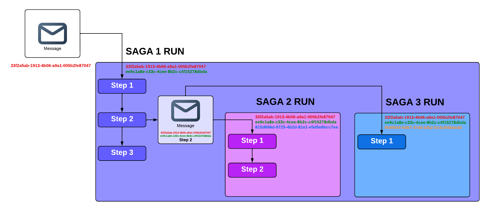

In the [previous article](posts/introducing-structured-cooperation), I gave you a whirlwind tour of some of the features
of [Scoop](https://github.com/gabrielshanahan/scoop), a POC implementation of something I'm calling **structured
cooperation**. I showed you how making the components of a distributed system obey a [single, simple
rule](posts/introducing-structured-cooperation/#the-rule-of-structured-cooperation) made the resulting system easier to
reason about, behave predictably in the presence of failures, and also allowed us to recover features we know from
"regular" programming, such as distributed exceptions and resource handling. However, I didn't go into too much detail
about *how* exactly Scoop implements structured cooperation, and also glossed over some very fundamental issues that
arise in this context---most especially the topic of "how does Scoop figure out which handlers it should be waiting for
in the first place." This is what I'd like to discuss in this article.

To give you an idea about the level of abstraction this article is situated at---if, in the previous article, I had
talked about "what would we get if computers could communicate statelessly across the internet," then this article would
be about the HTTP protocol. In that metaphor, Scoop is a POC webserver, and the technical details of *how* that web
server is implemented is an equally interesting subject---in the case of the actual Scoop, it involves an implementation
of distributed coroutines on top of Postgres. However, that's not something that we'll be discussing here. For that,
I'll direct you to the `README` in the repository and the heavily commented codebase itself---I wrote it with the
assumption that it was going to be read, and did my best to make it accessible and understandable.

I should also note that I often use the terms "saga" and "(message) handler" interchangeably, because in Scoop, they
are---all message handlers are sagas, and all sagas are message handlers. Naturally, that is not the case outside of
Scoop.

## Implementing Structured Cooperation

Let's restate the fundamental rule of structured cooperation:

> A message handler (= saga) does not continue with the next step until all handlers of all messages emitted during the
> current step have finished executing.

To implement that, you need two things:

* Keep track of which messages were emitted from which step of which saga
* Be able to figure out if a handler has finished or not

### Keeping track of where messages came from

Scoop does this by associating a list of unique UUIDs, called a *cooperation lineage*, to each emitted message, and to
each saga *run*. Any time a message gets emitted by some place, and a saga picks it up and starts running, that entire
run (i.e., all the steps involved in that execution, including any rollbacks) is assigned a UUID (called a
*cooperation ID*), which is appended to the cooperation lineage.

When a message is emitted from within a saga run, it is tagged by the cooperation lineage of the run, the name of the step,
and any sagas that run as a result of this message build their own cooperation lineage by appending their unique
cooperation ID to the cooperation lineage of the message, and so on. Any top-level message (i.e., one emitted outside a
saga, or [on the global scope](posts/introducing-structured-cooperation/#what-if-i-dont-want-to-cooperate), which is the
same thing), has a cooperation lineage of length one.



Doing it like this has the effect of structuring the saga runs into a parent-child hierarchy, and allows us to refer to
useful parts of this hierarchy. A specific run of a saga can be queried for as `WHERE cooperation_lineage = <some
UUIDs>`. A run of a saga and its entire sub-hierarchy, i.e., any sagas that were triggered as the result of any
messages in, can be queried for as "`cooperation_lineage` is prefixed by `<some UUIDs>`[^index].

[^index]:<small>And since this is UUIDs we're talking about, we can safely change this to "`cooperation_lineage`
contains `<some UUIDs>`," or `WHERE cooperation_lineage @> <some UUIDs>` in Postgres. This kind of querying is used
extensively in Scoop, and Postgres allows you to build [an index for
it](https://www.postgresql.org/docs/current/gin.html).</small>

This "subtree" is conceptually (but not literally) enclosed by something called a `CooperationScope`, which intuitively
corresponds to the three large colored rectangles on the picture above. You will find an object called
`CooperationScope` in the code, and is meant to represent something that spans the entire saga run, and all its
children. If you're familiar with structured concurrency, this is, to an extent, the conceptual counterpart of something
found in almost all implementations---in Kotlin coroutines, it's the
[`CoroutineScope`](https://kotlinlang.org/api/kotlinx.coroutines/kotlinx-coroutines-core/kotlinx.coroutines/-coroutine-scope/),
in Trio, it's the [`Nursery`](https://trio.readthedocs.io/en/stable/reference-core.html#trio.Nursery) , in Java, it's
the
[`StructuredTaskScope`](https://download.java.net/java/early_access/loom/docs/api/java.base/java/util/concurrent/StructuredTaskScope.html),
in Swift, it's the [`TaskGroup`](https://developer.apple.com/documentation/swift/taskgroup). It's also the type of that
`scope` parameter you've been seeing in all the code examples, and the picture above lends interpretation to "launching
a message on a scope."

If the stuff about `CooperationScope` is too confusing or abstract for you, don't worry about it; you don't need to
understand all that to understand structured cooperation. It's more about connecting it to other existing concepts some
people might be familiar with.

### Keeping track of execution state

Anytime something interesting happens, e.g., a handler sees a message published on the topic it's subscribed to, or
finishes executing a step, or a rollback gets triggered, or the entire saga run finishes, etc., Scoop makes a note of
that fact. It does so by writing an entry into a special table, called `message_events`, that stores, well, *events*
related to message handling.

That table serves two purposes:

* To determine if a given saga is ready to move on to the next step
* To build the state necessary to actually run that step (we need to know things like what step we should execute next,
  if any children failed during the last one, if a rollback is already in progress, etc.)

I think it might be easier to show you what it looks like before I dive any deeper. Here is some (simplified) code that
defines two sagas, and publishes a message:

```kotlin
messageQueue.subscribe(
    rootTopic,
    saga("root-handler") {
        step { scope, message ->
            scope.launch(childTopic, JsonObject())
        }

        step { scope, message -> }
    },
)

messageQueue.subscribe(
    childTopic,
    saga("child-handler") {
        step { scope, message -> }
        step { scope, message -> }
    },
)

messageQueue.launch(rootTopic, JsonObject())

```

And here's what `message_events` would look like after this finishes running, ordered by time:

| message\_id | type      | coroutine\_name | coroutine\_identifier | step | cooperation\_lineage |
|:------------|:----------|:----------------|:----------------------|:-----|:---------------------|
| b796        | EMITTED   | null            | null                  | null | {56b9}               |
| b796        | SEEN      | root-handler    | 5191                  | null | {56b9,5310}          |
| 4501        | EMITTED   | root-handler    | 5191                  | 0    | {56b9,5310}          |
| b796        | SUSPENDED | root-handler    | 5191                  | 0    | {56b9,5310}          |
| 4501        | SEEN      | child-handler   | 62b8                  | null | {56b9,5310,6817}     |
| 4501        | SUSPENDED | child-handler   | 62b8                  | 0    | {56b9,5310,6817}     |
| 4501        | SUSPENDED | child-handler   | 62b8                  | 1    | {56b9,5310,6817}     |
| 4501        | COMMITTED | child-handler   | 62b8                  | 1    | {56b9,5310,6817}     |
| b796        | SUSPENDED | root-handler    | 5191                  | 1    | {56b9,5310}          |
| b796        | COMMITTED | root-handler    | 5191                  | 1    | {56b9,5310}          |


I truncated all UUIDs to the last four characters to save visual space, and I'm also leaving out a few columns for the
same reason: `id`, the primary key of the row, `created_at`, which contains the timestamp the row was inserted,
`exception`, which only comes into play when dealing with rollbacks, and `context`, which is used to share data across
steps, or even across different parts of the cooperation hierarchy. We'll talk more about the latter two later on. In
this example, both columns are `null` everywhere.

| Column | Explanation |
| :--- | :--- |
| message\_id | The id of the associated message in the `messages` table |
| type | The identifier of the type of event that occurred. More on this bellow |
| coroutine\_name | The name of the handler/saga, if present |
| coroutine\_identifier | The identifier of the handler/saga (for situations where the service is scaled horizontally) |
| step | The step name (or its ordinal, if not specified), if applicable |
| cooperation_lineage | Explained above |


With this setup, adhering to the rule of structured concurrency essentially boils down to building a (moderately
complicated)
[query](https://github.com/gabrielshanahan/scoop/blob/master/src/main/kotlin/io/github/gabrielshanahan/scoop/blocking/coroutine/structuredcooperation/PendingCoroutineRunSql.kt)
that checks if a saga is ready to proceed or not. In Scoop, that amounts to asking "for all messages emitted in the
previous step, does every `SEEN` have a corresponding `COMMITTED`" (plus the equivalent for rollbacks, which we'll get
to).

In other words, when you strip it down, Scoop is essentially this:

* Provide a way to publish messages to topics
* Provide a way to associate an object (= saga/handler) containing a list of functions (= steps) to a topic
* When that association is created, launch a periodic process that, on each "tick":
  * Checks if an as-yet-unseen message was emitted to that topic. If so, it launches a new saga run (amounts to writing
    the `SEEN` record above). Also performs something similar for rollbacks.
  * Runs the query mentioned above and checks if any existing run is ready to continue. If so, it uses the contents of
    `message_events` to pick the correct function (step) to run, and invokes it. When it finishes, it writes the
    appropriate row to `message_events`, depending on the result. This also makes it non-blocking by design, i.e., there
    aren't any processes waiting around until something else finishes.
    
And that's pretty much all there is to it.

With one exception.

## EventLoopStrategy

This entire time, we've been skirting a fundamental issue, one that profoundly influences the properties of the system
you end up building with Scoop.

The rule of structured cooperation is "don't continue until all handlers have finished executing." So how do you know
which handlers you should be waiting for in the first place? When you think about it, it's not obvious what the correct
answer is. For example, a naive approach could be, e.g., "After a message emission, just wait for X amount of time, after
which all registered handlers will surely have seen the new message and written their `SEEN` event. Then, wait until
those `SEEN`'s are terminated."

But what if a network partition happens, and some handler is not available for a period of time longer than it takes all
the others to complete? What if you just deployed a new service that happens to be listening to that message? What
happens if the `SEEN` was written, so you know you should be waiting for it, and *then* a network partition occurs? Or
you take the service offline deliberately?

All of these, and more, are questions you need to ask yourself, and *there is no one correct answer*---the answer is "it
depends." Scoop recognizes this, provides an API that's deliberately designed around the fact that you need to figure
this out, and forces you to make an explicit decision.

It turns out that this is a specific instance of a more general question: *under what conditions is a saga ready to be
resumed*? Naturally, the way we've been answering this question this entire time is "when the rule of structured
concurrency is obeyed," but that's not the only useful answer.

Here's another one: *when a certain amount of time has elapsed*. And boom! You just got `sleep()` for free. And when you
have `sleep()`, you also have task scheduling. Just like that.

An associated question you can ask is, *under what conditions should you give up on a saga*? Here are some useful answers:

* when a deadline has passed,
* when a cancellation has been requested.

Again, you get powerful and well-established features, but you don't get them as primitives that need to be built in,
but rather as things that are built on something even more fundamental. If Scoop didn't implement timeouts or
cancellations, you could just as easily do it yourself.

The API in question is called an `EventLoopStrategy`, which is an interface exposing four methods: `resumeHappyPath`,
`giveUpOnHappyPath`, `resumeRollbackPath`, `giveUpOnRollbackPath`. We've introduced the former two, and the latter are
the equivalent for rollbacks. The `giveUp` variants are checked by Scoop automatically on the "boundaries" of a step,
i.e., before a step starts executing and after it stops. You can also check it on demand from a step by calling
`scope.giveUpIfNecessary()` inside a step, which will throw the appropriate exception if necessary---Scoop is
[cooperative](https://en.wikipedia.org/wiki/Cooperative_multitasking).

All these methods return raw SQL that is injected[^green] directly into the query that checks if some saga is ready to
continue. Scoop provides reasonable implementations for all of these methods, and you're encouraged to build
your own. It's called `EventLoopStrategy` because an event loop is the technical term for a thing that "periodically
checks if there's something to do, and does it."

[^green]:<small>This is bound to make people green in the face, but again---I'm trying to communicate an idea here.
Focus on that, and [be a loose lily floating down an amber river](https://www.youtube.com/watch?v=eCT-PImSMzs).</small>

### Discoverability of handler topologies

Since it so fundamentally influences the system you end up building, I want to spend a little time discussing the
original question that motivated `EventLoopStrategy`: how do we determine which handlers we should be waiting for? This
question stands at the center of how you implement `resumeHappyPath` (and `resumeRollbackPath`).

A good question to start with is if the handler topology of your system is fundamentally discoverable or not. What I
mean by that fancy word cocktail is a system where you can, at any time, determine which components are participating,
what topics they're listening to, and what messages they emit. Perhaps you have a static registry in a JSON file that's
updated with each deployment, and part of each deployed service. Perhaps you have a component dedicated to providing
that information, e.g., some sort of service registry. Perhaps it's something else. But somehow, it is always possible to
determine the correct answer to that question.

The reason this question is important is that it determines what options you have from the perspective of the [CAP
theorem](https://en.wikipedia.org/wiki/CAP_theorem)---if your system is not discoverable, you cannot ever guarantee
consistency, and all you can focus on is availability. Structured cooperation is fundamentally about enforcing
consistency, so if you want to use it for that purpose, you need to invest the effort necessary to make your topology
discoverable.

At least in theory, I can imagine there could be situations where it really might not be possible, *by design*. In those
instances, you can still do a kind of "best-effort" structured cooperation---for example, you can guarantee that any
service that ACKs a new message within X amount of time will be included in structured cooperation. It's kind of like a
train schedule---you need to be on board by a certain time, and once you're on board, you all move as one piece. But if
you miss the train, you get left behind.

My personal hunch is that the vast majority of practical systems are discoverable, at least in theory, so I want to
spend some time discussing them. Even under the assumption of discoverability, things are not exactly trivial when
combined with the reality of any distributed system of any complexity---things keep changing *all the time*.

### Building and maintaining a handler topology

In order to build a handler topology for the system, each service needs to publish this information about itself
in some manner. Ideally, that would be done in some automated fashion directly from the code---there are a thousand ways
to do that in any mature ecosystem. If you're dealing with some horrible legacy system, maybe you can [ask your
MQ](https://kafka.apache.org/documentation/#basic_ops_consumer_group), or use [something more
advanced](https://docs.dynatrace.com/docs/discover-dynatrace/platform/smartscape). Or maybe you like to watch the world
burn, and require filling out a form with that information as part of the deployment process. But somehow, you need to
do this.

Then, you need to make this data accessible to all other services. Collecting that data for all services and bundling it
with each app would be nice, but not very practical, as you would need to deploy a new version of *every* service
whenever it changed for *any* of them. A much more realistic approach would be to publish this information to some
central place---could be in a database that's accessible to all services, or your own custom service, or maybe something
like [Backstage](https://backstage.io/). Just keep in mind that whatever this place is, it is a
[SPOF](https://en.wikipedia.org/wiki/Single_point_of_failure), and needs to be placed into the same QoS category as your
MQ---if it goes down, the world goes down, or at least gets severely degraded.

That's the easy part.

The difficult part is dealing with deployments that change this handler topology. There are two issues here:

* How to let the individual services know that something has changed?
* How to deal with running cooperation hierarchies that will be affected by what's being deployed?

The former is basically cache invalidation. Each time the event loop of each service checks if there's a saga that can
be resumed, it needs to access the information of what other sagas it should be waiting for. Obviously, that can't be a
network request, because a) that would take forever, and b) it would probably hammer your registry into oblivion. So
each service needs to cache a copy and be notified when it's no longer up-to-date. This needs to be part of the
deployment pipeline. [^deployment]

[^deployment]: <small>A nice way to do that would be to have a `deployment` topic that all services could listen to,
where any topology changes would be published as part of the deployment pipeline. Of course, we'd also like to wait for
all services to acknowledge they've updated their cache, so we don't get into a situation where we deploy a new handler,
and there's a time window where some services know that they should wait for it, and some don't---that could lead to
messy situations. In other words, we'd like to publish the message and *wait* for all services to finish updating their
cache. Do you see where I'm going with this?</small>

The latter involves determining which services will be affected by the change (e.g., those that have a handler that
publishes messages whose handlers are affected by the deployed change---either their behavior is being changed, or a new
handler added, or an old one removed, etc.), and doing two things:

1. Notifying them to pause processing of new messages (and unpausing them after the deployment is finished)
2. Waiting for them to finish processing any existing messages (or, alternatively, cancelling any that are currently
   running)

If you don't do that, you could get into any one of many inconsistent states---some handlers are running old code, some
are running new, some know they should be waiting for a new handler at a certain step, some don't and some handlers
start processing a message from the middle of a series of steps but didn't process messages emitted in previous steps,
and so on.

Obviously, this isn't trivial and involves consideration of lots of edge cases, e.g., how long it's acceptable for a
given message to not be processed, or how long it's acceptable to wait for handlers to finish doing their thing. You
also need to properly handle any failures, e.g., if a handler was paused and then the deployment fails down the line,
you need to unpause it again[^pause]. As hinted at in the previous two footnotes, all this corresponds exactly with what
a saga is, publishing messages to topics is a very natural way to solve this problem, and the challenges involved are
precisely what structured cooperation was designed to solve.

[^pause]:<small>Notice how we want to unpause a handler regardless of how the deployment ends. Handler inactivity is an
expensive thing---[a resource](posts/introducing-structured-cooperation/#resource-handling).</small>

I don't presume to tell you how you should or shouldn't solve any of this, mainly because the landscape is so
heterogeneous that I don't really believe there is any way of formulating a sensible answer. But whatever the answer
might be in your particular case, you have the option of using structured cooperation itself to help you implement it.

One final note on `EventLoopStrategy`---Scoop contains a dummy implementation that only works if all services are
actually instances of the same service. Each time a saga starts listening on some topic, it's added to a local registry
(basically a `HashMap`) that is then used for reference when building the list of handlers to wait for. Naturally this
isn't an implementation that's viable for production use, although it's still powerful enough to allow you to scale a
given app horizontally with no additional work. Its main purpose is, as with Scoop itself, to convey an idea.

## Rollbacks
We've mentioned rollbacks quite a few times, but we've been putting off taking a closer look at their semantics. Let's
fix that.

First, to [recap](posts/introducing-structured-cooperation/#distributed-stack-unwinding):
* Each saga step also defines an associated *compensating action*, which reverses whatever effect the step itself had.
  The default value is a lambda that does nothing.
* When an unhandled exception is thrown during the execution of some step, the compensating actions are executed in the
  reverse order.
  * As a consequence, if any messages were emitted during the execution of a step, and any sagas reacted to those
    messages, the compensating actions of those sagas are run first (again, in reverse order), and only then is the
    compensating action of the "parent" step run.
    
As we did when explaining the rudiments of how Scoop works a few paragraphs ago, it'll be better if I first show you a
few examples of what the message events look like in various rollback scenarios, so here are a few sagas (omitting the
`EventLoopStrategy`) with their associated message events when they are triggered. As before, I'm truncating any UUIDs
to the last 4 characters, and excluding some columns (`id`, `created_at`, `coroutine_identifier` and
`cooperation_lineage`). Unlike before, I'm no longer excluding the `exception` column, but I'm obviously not including
the full serialized JSON, instead opting for a symbolic placeholder.

```kotlin
// a handler failing in a step never actually publishes any
// message emitted from that stepp, since the transaction
// doesn't commit
saga("root-handler") {
    step { scope, message ->
        scope.launch("child-topic", JsonObject())
        throw RuntimeException("Geronimo!")
    }
}
```

| message\_id | type          | coroutine\_name | step          | exception                     |
|:------------|:--------------|:----------------|:--------------|:------------------------------|
| 8aaa        | EMITTED       | null            | null          | null                          |
| 8aaa        | SEEN          | root-handler    | null          | null                          |
| 8aaa        | ROLLING\_BACK | root-handler    | 0             | RuntimeException("Geronimo!") |
| 8aaa        | ROLLED\_BACK  | root-handler    | Rollback of 0 | null                          |

---

```kotlin
saga("root-handler") {
    step(
        invoke = { scope, message -> },
        rollback = { scope, message, throwable -> throw IllegalArgumentException("Geronimo again!") },
    )
    step { scope, message ->
        scope.launch("child-topic", JsonObject())
        throw RuntimeException("Geronimo!")
    }
}
```

| message\_id | type             | coroutine\_name | step                                        | exception                                   |
|:------------|:-----------------|:----------------|:--------------------------------------------|:--------------------------------------------|
| a8bf        | EMITTED          | null            | null                                        | null                                        |
| a8bf        | SEEN             | root-handler    | null                                        | null                                        |
| a8bf        | SUSPENDED        | root-handler    | 0                                           | null                                        |
| a8bf        | ROLLING\_BACK    | root-handler    | 1                                           | RuntimeException("Geronimo!")               |
| a8bf        | SUSPENDED        | root-handler    | Rollback of 0 \(rolling back child scopes\) | null                                        |
| a8bf        | ROLLBACK\_FAILED | root-handler    | Rollback of 0                               | IllegalArgumentException("Geronimo again!") |

---

```kotlin
saga("root-handler") {
    step { scope, message ->
        scope.launch("child-topic", JsonObject())
    }
}

saga("child-handler") {
    step { scope, message -> }
    
    step { scope, message ->
        throw RuntimeException("Geronimo!")
    }
}
```

| message\_id | type              | coroutine\_name | step                                        | exception                                                                                                                                       |
|:------------|:------------------|:----------------|:--------------------------------------------|:------------------------------------------------------------------------------------------------------------------------------------------------|
| 5e96        | EMITTED           | null            | null                                        | null                                                                                                                                            |
| 5e96        | SEEN              | root-handler    | null                                        | null                                                                                                                                            |
| c714        | EMITTED           | root-handler    | 0                                           | null                                                                                                                                            |
| 5e96        | SUSPENDED         | root-handler    | 0                                           | null                                                                                                                                            |
| c714        | SEEN              | child-handler   | null                                        | null                                                                                                                                            |
| c714        | SUSPENDED         | child-handler   | 0                                           | null                                                                                                                                            |
| c714        | ROLLING\_BACK     | child-handler   | 1                                           | RuntimeException("Geronimo!")                                                                                                                   |
| c714        | SUSPENDED         | child-handler   | Rollback of 0 \(rolling back child scopes\) | null                                                                                                                                            |
| c714        | SUSPENDED         | child-handler   | Rollback of 0                               | null                                                                                                                                            |
| c714        | ROLLED\_BACK      | child-handler   | Rollback of 0                               | null                                                                                                                                            |
| 5e96        | ROLLING\_BACK     | root-handler    | 0                                           | ChildRolledBackException(<br>&nbsp;&nbsp;RuntimeException("Geronimo!")<br>)                                                                     |
| c714        | ROLLBACK\_EMITTED | root-handler    | Rollback of 0 \(rolling back child scopes\) | ParentSaidSoException(<br>&nbsp;&nbsp;ChildRolledBackException(<br>&nbsp;&nbsp;&nbsp;&nbsp; RuntimeException("Geronimo!")<br>&nbsp;&nbsp;)<br>) |
| 5e96        | SUSPENDED         | root-handler    | Rollback of 0 \(rolling back child scopes\) | null                                                                                                                                            |
| 5e96        | SUSPENDED         | root-handler    | Rollback of 0                               | null                                                                                                                                            |
| 5e96        | ROLLED\_BACK      | root-handler    | Rollback of 0                               | null                                                                                                                                            |

The "scopes" in "rolling back child scopes" is referring to the `CooperationScope` we briefly mentioned above.
Basically, it is a synonym for what could intuitively be called "message hierarchies," i.e., "rolling back child message
hierarchies."

I'd like to give more examples, but you can see that the table starts getting pretty long, so I'll refer you to the
[test
suite](https://github.com/gabrielshanahan/scoop/blob/master/src/test/kotlin/io/github/gabrielshanahan/scoop/blocking/coroutine/structuredcooperation/RollbackPathTest.kt)
instead---I think playing around with different scenarios and looking at what the `message_event` table looks like
after, is the easiest way to understand it.

Here are the most important points:
* If an unhandled exception is thrown in some step, instead of writing a `SUSPENDED` (if it's not the final step) or
  `COMMITED` (if it was the final step) message event, a `ROLLING_BACK` is writen. A `ROLLING_BACK` is, in a sense,
  semantically similar to a `SEEN`, in that it signifies a "start" of something---while `SEEN` is the start of the happy
  path, a `ROLLING_BACK` is the start of the rollback path
* When that saga is next picked up for execution, the last **finished** (= the local transaction committed) step is
  looked up, and the set of messages emitted in that step is built from the `EMITTED` records corresponding to the step.
  A `ROLLBACK_EMITTED` is written for each such message, after which the saga suspends (a `SUSPENDED` is written), and is
  not picked up again until all child sagas have finished rolling back (as determined by the `EventLoopStrategy`). Only
  then is the compensating action of the step actually run, after which another `SUSPENDED` is written, and the process
  continues for previous steps.
* Child sagas react to the `ROLLBACK_EMITTED` by writing their own `ROLLING_BACK`, starting the same process for
  themselves. 
* If all steps rolled back successfully, a `ROLLED_BACK` is emitted---the equivalent of `COMMITTED` for rollbacks.
* If an unhandled exception is thrown during the execution of any compensating action, a `ROLLBACK_FAILED` is emitted,
  and the compensation is halted there.
* If multiple failures happen in different children, the exceptions are combined (i.e., no failure is thrown away).
  
All this is really verbose to write out, but the principles are actually fairly simple. The basic rule to remember is
that rollbacks amount to "running the sagas backwards"---pretty much all aspects of the implementation follow from that.

There is one last thing I should mention before moving on---each `step()` actually accepts a third parameter, also a
lambda, called `handleChildErrors`. Any unhandled exceptions that bubble up from children are first sent into this
function. If it returns normally (i.e., doesn't throw an exception), the exception is considered handled, and execution
goes on as if the child completed normally. This is basically the semantic equivalent of a `catch` block wrapped around
all child executions from that step, and allows you to do things like retries (you can emit messages from there in the
same way), or ignoring child failures.

However, you should know that this is one of the things whose actual implementation is a little half-baked, and there
are various things you need to be aware of when using it. All of them are solvable; I just didn't invest the time to do
so. The main thing you need to take away is that having something like `handlerChildErrors` is crucial for the ability
to implement certain important features.

The default implementation always throws whatever exception is passed into it.

### CooperationFailure & CooperationException
Since structured cooperation is, by design, language agnostic, you can have services running code in completely
different languages all participating in a message hierarchy. If a failure happens in one place, it needs to be
representable in whatever it bubbles up to, i.e., if a handler in Python emits a message that is picked up by a handler
in Haskell, and that handler fails somehow, we need a way to represent that failure in the Python handler as well.

Therefore, a common protocol for representing failures is a necessary part of structured cooperation. Scoop provides an
implementation via `CooperationFailure`, which is a data structure containing data typically associated with a
failure---the type of failure, a message, a stack trace, and a list of causes. This is what determines the serialized
data in the `exception` column. Inside Scoop, a JVM implementation of structured cooperation, this is then translated to
a `CooperationException`, which is what is then thrown around. The concept of `CooperationFailure` pertains to
structured cooperation as a whole, and its format must be agreed and adhered to by all participants (same as, e.g., that
there is a `message_event` table, what is written to it, and when). The concept of `CooperationException` is specific to
Scoop, which is one of many possible structured cooperation implementations, in one of many possible languages.

You should also note that even though there is a standard representation of a failure across systems, you should be very
wary to actually using that representation as part of any sort of code logic (e.g., checking for a specific type of
exception bubbling up from children), because if you do that, you're tightly coupling your handler to code in a service
that's far away, and the format of the failure must be treated as part of the public API of that specific
service---just, e.g., refactoring the name of an exception could break your code.

While structured cooperation fundamentally *does* introduce coupling, it only introduces *causal* coupling, not
*procedural*/*behavioral* coupling. If procedural coupling is what you need, then you probably should be using some form
of RPC, not "fire-and-forget" messages.[^rpc]

[^rpc]:<small>I should note that messaging is absolutely a way to implement RPC, e.g. you send a message (typically
called a *command*) to a topic, and receive a response on another.</small>

### Cancellation requests
Canceling a running saga on request is actually really simple to implement. A special kind of message event type,
`CANCELLATION_REQUESTED`, is written, and the default `EventLoopStrategy` used by Scoop checks for it in its
`giveUpOnHappyPath` and `giveUpOnRollbackPath` implementations. That's pretty much all it takes.

### Undo/rollback requests
Due to the way it's designed, Scoop supports doing rollbacks whenever you want---even if a saga is already completed,
you can just write a `ROLLBACK_EMITTED` and all the magic just works. So you get undo for free.

The only thing you should be wary about is rolling back anything but a top-level message hierarchy. While there's nothing
technical from stopping you from rolling back a subhierarchy, you're essentially transitioning the system into an
inconsistent state, which should be done with caution. But Scoop allows you to do both.

## CooperationContext
The last fundamental building block incorporated by Scoop which we've been glossing over until now, is
`CooperationContext`, which is a way to share data across the entire message hierarchy. Basically, it's a writable
object that's accessible in all steps in all sagas that participate in a given message hierarchy, and it's crucial for
implementing certain features, such as the `try-finally` used for resources or deadlines (discussed below). As we
mentioned in the last article, you can think of it as the equivalent of [reactive
context](https://projectreactor.io/docs/core/release/reference/advancedFeatures/context.html),
[CoroutineContext](https://kotlinlang.org/api/core/kotlin-stdlib/kotlin.coroutines/-coroutine-context/), etc., if you're
familiar with those concepts. If not, don't worry about it.

Here's an example:

```kotlin
data object MyContextKey :
    CooperationContext.MappedKey<MyContextValue>()

data class MyContextValue(val value: Int) :
    CooperationContext.MappedElement(MyContextKey)
    
saga("root-handler") {
    step { scope, message -> 
        scope.context += MyContextValue(3)
        scope.launch("child-topic", JsonObject())
    }
    
    step { scope, message ->
        // logs 3
        log.info(scope.context[MyContextKey]!!.value) 
    }
}

saga("child-handler") {
    step { scope, message -> 
        // logs 3
        log.info(scope.context[MyContextKey]!!.value) 
    }
}
```

The implementation is heavily inspired by Kotlin's
[`CoroutineContext`](https://kotlinlang.org/api/core/kotlin-stdlib/kotlin.coroutines/-coroutine-context/), although you
don't need to know anything about that to understand it. All you need to know is that a `CooperationContext` can be
thought of as a HashMap, associating keys (instances of `CooperationContext.MappedKey`) to values/elements (instances of
`CooperationContext.MappedElement`, which is propagated across the message hierarchy in a particular way. The rules of
this propagation is the main thing that you need to understand.

The `launch` method on `messageQueue`, which is used to launch top-level messages from outside of a saga, allows you to
add a context parameter---this becomes the context in the first step of all sagas that react to that message. A saga may
mutate its own context at any point, in which case this mutation will be seen in all subsequent steps. Additionally, all
`launch` methods on `scope` inside a step also allow you to pass a context value, which is then *combined* to form the
context of the first step of any child handlers that react to *that* message. Any changes done inside child handlers
only propagate to *their* children, i.e., `CooperationContext` allows you to send data from parent to child, but not the
other way around.


```kotlin
saga("root-handler") {
    step { scope, message -> 
        scope.context += MyContextValue(1)
        // logs MyContextValue(1)
        log.info(scope.context[MyContextKey]) 
        
        scope.launch("child-topic", JsonObject(), ChildContextValue(2))

        scope.context += MyContextValue(3)
        // logs MyContextValue(3)
        log.info(scope.context[MyContextKey]) 
        // logs null
        log.info(scope.context[ChildContextKey])
    }
    
    step { scope, message ->
        // logs MyContextValue(3)
        log.info(scope.context[MyContextKey]) 
        // logs null
        log.info(scope.context[ChildContextKey])
    }
}

saga("child-handler") {
    step { scope, message -> 
        // logs MyContextValue(1)
        log.info(scope.context[MyContextKey]) 
        
        scope.context += MyContextValue(10)
        
        // logs MyContextValue(10)
        log.info(scope.context[MyContextKey]) 
        // logs ChildContextValue(2)
        log.info(scope.context[ChildContextKey])
    }
}
```

Things get a little more interesting when rollbacks are involved. The context traverses back up the steps in reverse,
same as the execution flow. If, in a step, child rollbacks are triggered, the context travels to them as well, where it
is combined with the context from the child's last step (the "parent" context takes precedence if both contexts have any
common keys).

`CooperationContext` is the building block upon which deadlines and `sleep()` are built---the final features we'll talk
about here. Since this post is already alarmingly long, I'll restrict myself to a few paragraphs and invite you to take
a look at the [test
suite](https://github.com/gabrielshanahan/scoop/tree/master/src/test/kotlin/io/github/gabrielshanahan/scoop/blocking) to
see them in action.

### Deadlines
The concept of deadlines is how Scoop implements timeouts, inspired (as is Scoop itself) by the work of the wonderful
[Nathaniel J. Smith](https://vorpus.org/). I recommend you read his insightful thoughts on [timeouts and
cancelations](https://vorpus.org/blog/timeouts-and-cancellation-for-humans/).

A deadline is a time by which a message hierarchy must be completed. Scoop allows you to specify a deadline for the happy
path, a deadline for the rollback path, and a deadline for both paths combined. All three deadlines are represented as
their own `CooperationContext` keys, which are respected by the default `EventLoopStrategy` implementations `giveUpOnX`
methods. The way `CooperationContext` propagates across the hierarchy ensures that a deadline applied to a message
applies to all child messages as well, while also allowing parents to set stricter deadlines for their children.
Deadlines also implement a tracing mechanism that allows you to determine where the given deadline originated from.

### Delayed execution, scheduling & periodic execution
Delayed execution, a.k.a. sleeping, is implemented using two things:

* A `CooperationContext` key containing the time until which we should be sleeping
* A dedicated handler, built into Scoop and listening to a dedicated topic, that uses a custom `EventLoopStrategy` which
  only runs the handler after the time elapses.

Sleeping is then achieved by emitting a message on that sleep topic, with the appropriate context value.

This automatically gives you scheduling---things like "send a survey 2 days after a purchase" involve creating a saga
listening to the `purchases` topic that sleeps for 2 days as its first step. It also gives you periodic execution---a
saga which first sleeps for the period of execution, then emits a message to the same topic to which it listens using
`scope.launchOnGlobalScope`, then proceeds with whatever it is supposed to do.

## Next steps

There's more we could talk about. For example, we could talk about how the contents of `message-event` impact
observability & tracing, and how they are invaluable debugging tools---so much so that when I implemented a stripped
down version of structured cooperation in an [Axon app](https://www.axoniq.io/products/axon-framework) I was
maintaining, it immediately became the first place anyone would go when there was any kind of problem. It also allowed
us to catch a really, really [nasty
bug](https://discuss.axoniq.io/t/multitenancy-dangerous-associationvalueentry-entity-definition/5712/5)--- I shudder to
think what debugging that would look like without it.

But I'll leave it at that and talk about one final thing---where we go from here.

Obviously, the first thing that needs to happen is that the community needs to pound at everything I'm talking about
here. I expect there to be at least some pushback, because, like in [both preceding applications of the
idea](https://vorpus.org/blog/notes-on-structured-concurrency-or-go-statement-considered-harmful/#id11) (more on this in
the next article), structured cooperation will probably make certain patterns obsolete, and people who are used to
applying and thinking in terms of those patterns aren't going to like having to learn to do things a different way.

To that end, I'd like to ask any readers with thoughts on the subject to please create an
[issue](https://github.com/gabrielshanahan/scoop/issues/). Anything from "How would one do X using structured
cooperation?" and "Wouldn't X be a better approach to solve Y?" to "I see problem X in the way things are
implemented" and "We should implement this in X next," and any other thoughts you might have, are welcomed. Please
do your best to read through existing issues and see if there isn't one that matches what you want to say first, and
I'll do my best to answer them all as quickly as I can.

Assuming the community decides that there is value in this approach, the next step should be to put it to practical use.
As I've mentioned throughout both articles, structured cooperation is a *concept*, and it is implementable in any
language, in any framework, and on top of any infrastructure. Unfortunately, that also makes it a little difficult to
disseminate as a batteries-included package, because the landscape to which it is applicable is quite diverse. Scoop is
built in Kotlin on Postgres, but you're probably not using Postgres for messaging. Perhaps you want to implement the
equivalent of `message-event` on top of whatever MQ you're using. Perhaps you want to keep using a (shared) database for
that, but perhaps it's not Postgres. Perhaps you want to move Scoops event loop to a different place, e.g., run it in a
dedicated service, or perhaps you're feeling adventurous and want to implement it [directly inside
Postgres](https://github.com/pgadmin-org/pgagent). Perhaps you have a completely different idea of how structured
cooperation should be implemented. And perhaps you might want to do all that in 20 different frameworks and 20 different
languages.

That's one reason that I'm not currently pursuing turning Scoop into a production library---this will clearly require a
community effort, and solving it for a single combination of `(structured cooperation implementation, infrastructure,
framework, library)` wouldn't make that big of a dent. Rather, I think Scoop has value as something like a reference
implementation---something others can consult when implementing structured cooperation in their environment of choice.

That being said, if there's serious interest from the community and people willing to participate and/or sponsor the
work, I would consider working on polishing the JVM version and getting it to a production-ready state. Feel free to let
me know in the [corresponding issue](https://github.com/gabrielshanahan/scoop/issues/1).

## Where to go from here

If you've managed to keep reading until here, thank you---there's a lot to unpack here, and it can be a little
overwhelming.

If you want to learn more about how Scoop is implemented or play around with it, head on over to the [GitHub
repository](https://github.com/gabrielshanahan/scoop). Otherwise, feel free to continue to the [final
article](posts/framing-structured-cooperation) of the series. I should note that this one is not necessary for
understanding structured cooperation. It will, however, help convince you that structured cooperation isn't something
that just fell from the sky, but that it is just the latest incarnation of a concept with a very rich history that has
had a tremendous impact on the entire programming industry over the course of the last six decades.
